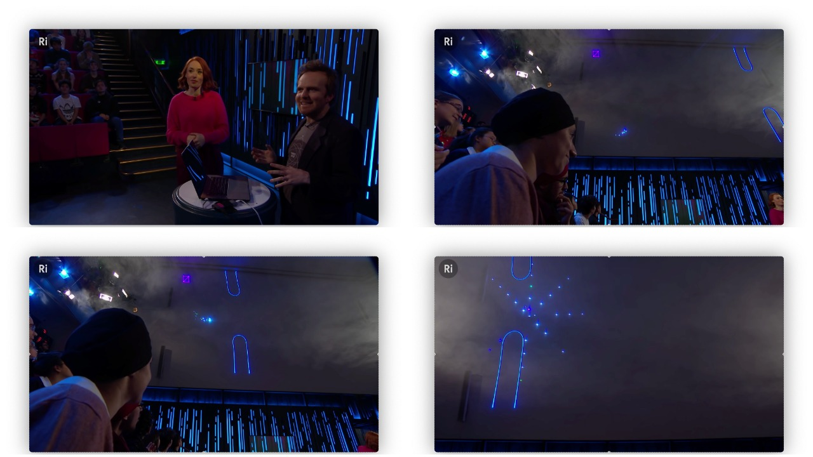

# Description

_TODO_

# Links

* [Christmas Lectures 2019: How to Bend the Rules - Hannah Fry](https://youtu.be/TtisQ9yZ2zo?t=563)
* [Seb Lee-Delisle &#8211; Laser artist and presenter](https://seblee.me/)
* Phaser:
  * [Phaser - A fast, fun and free open source HTML5 game framework](https://phaser.io/)
  * [Phaser 3 API Documentation](https://newdocs.phaser.io/docs/)
* My earlier attempt using only vanilla JavaScript:
  * [sparkler-game](https://github.com/taylorjg/sparkler-game)
