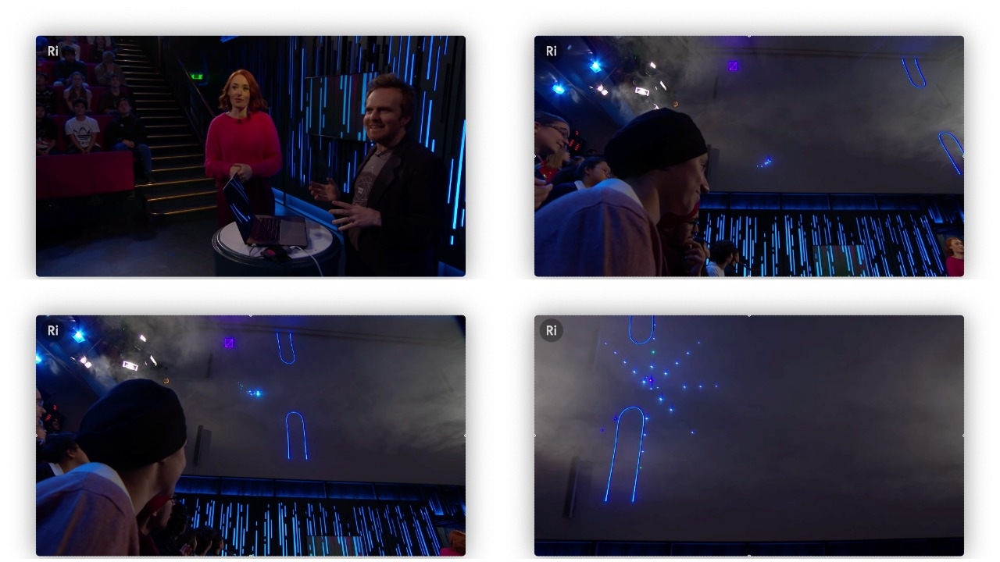

[](https://github.com/taylorjg/sparkler-game-phaser/actions/workflows/ci-cd.yaml)

# Sparkler Game (Phaser)

Recreate Seb Lee-Delisle's interactive sparkler game from the second Royal Institution Christmas Lecture with Dr Hannah Fry (27 December 2019). The audience used noise to guide a sparkler through a scrolling sequence of obstacles — this version lets you play the same game in the browser.

**Play:** [taylorjg.github.io/sparkler-game-phaser](https://taylorjg.github.io/sparkler-game-phaser/)



## Playing

You can control the sparkler in one of three ways:

- **Up arrow** — tap the key for a short burst of thrust (same feel as clicking)
- **Click / tap** — anywhere in the game window
- **Microphone** — make noise after enabling the mic icon (bottom right)

### Agent mode

Tap the robot icon (bottom right) to toggle agent mode on and off. When active, the game starts on its own and flaps using a behavioral-cloning model exported from [sparkler-game-rl](https://github.com/taylorjg/sparkler-game-rl).

Policy weights live in `public/assets/models/sparkler_bc.json`. Re-export from the RL repo with `docker compose run --rm dev python -m train.export_policy`, then copy the JSON into this project.

## Technologies

| Area | Stack |
|------|--------|
| **Game engine** | [Phaser 4](https://phaser.io/) (WebGL, Arcade physics, particles) |
| **Language** | [TypeScript](https://www.typescriptlang.org/) |
| **Build / dev server** | [Vite](https://vite.dev/) |
| **Audio input** | Web Audio API (`AudioContext`, `AudioWorklet`) with [audioworklet-polyfill](https://www.npmjs.com/package/audioworklet-polyfill) |
| **Logging** | [loglevel](https://www.npmjs.com/package/loglevel) (microphone module) |
| **Font** | [Vector Battle](https://www.dafont.com/vector-battle.font) TrueType (`vector-battle.ttf` in `public/assets/fonts/`, loaded via Phaser and styled in `src/ui/typography.ts`) |
| **Lint / format** | [ESLint](https://eslint.org/), [Prettier](https://prettier.io/), [typescript-eslint](https://typescript-eslint.io/) |
| **Hosting** | [GitHub Pages](https://pages.github.com/) via [gh-pages](https://www.npmjs.com/package/gh-pages) |
| **CI/CD** | GitHub Actions (lint, typecheck, build on push; deploy on tag) |

## Development

Requires **Node.js 24** (see `.nvmrc`).

### Run locally

```bash
npm install
npm run dev
```

Opens at [http://localhost:5173/sparkler-game-phaser/](http://localhost:5173/sparkler-game-phaser/)

### Scripts

| Command | Purpose |
|---------|---------|
| `npm run dev` | Vite dev server |
| `npm run build` | Production build to `dist/` |
| `npm run preview` | Preview production build |
| `npm run lint` | ESLint |
| `npm run typecheck` | `tsc --noEmit` |
| `npm run deploy` | Build and push `dist/` to `gh-pages` branch |

### CI/CD

On every push, GitHub Actions runs `lint`, `typecheck`, and `build`. Pushing a **version tag** (e.g. `v0.0.19`) also deploys to GitHub Pages after checks pass.

### Manual deploy

```bash
npm run deploy
```

## Links

- [Christmas Lectures 2019: How to Bend the Rules — Hannah Fry](https://youtu.be/TtisQ9yZ2zo?t=563)
- [Christmas Lectures 2019: Secrets and Lies](https://www.rigb.org/christmas-lectures/watch/2019/secrets-and-lies)
- [Seb Lee-Delisle — laser artist and presenter](https://seblee.me/)
- [Phaser](https://phaser.io/) · [Phaser docs](https://docs.phaser.io/)
- Earlier vanilla JS version: [sparkler-game](https://github.com/taylorjg/sparkler-game)
